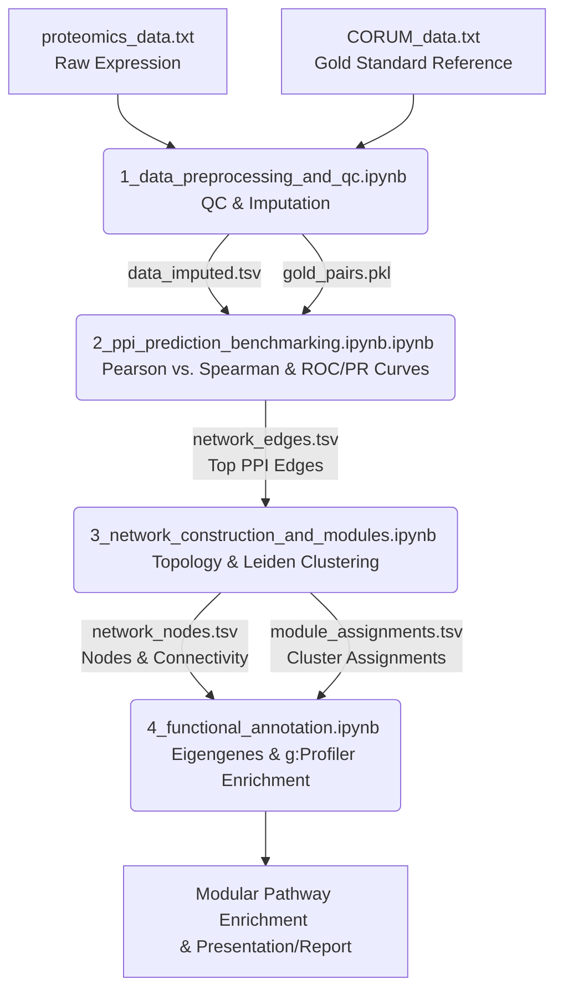
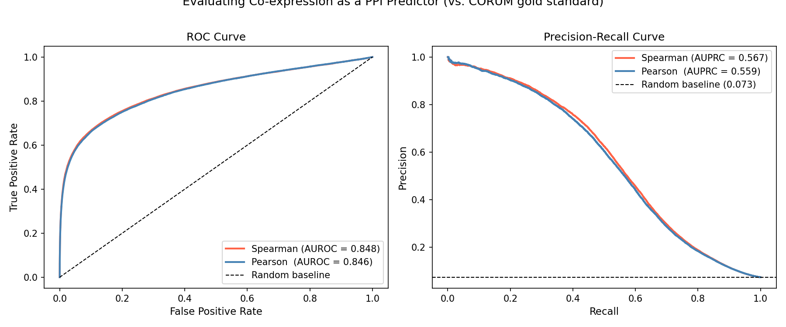
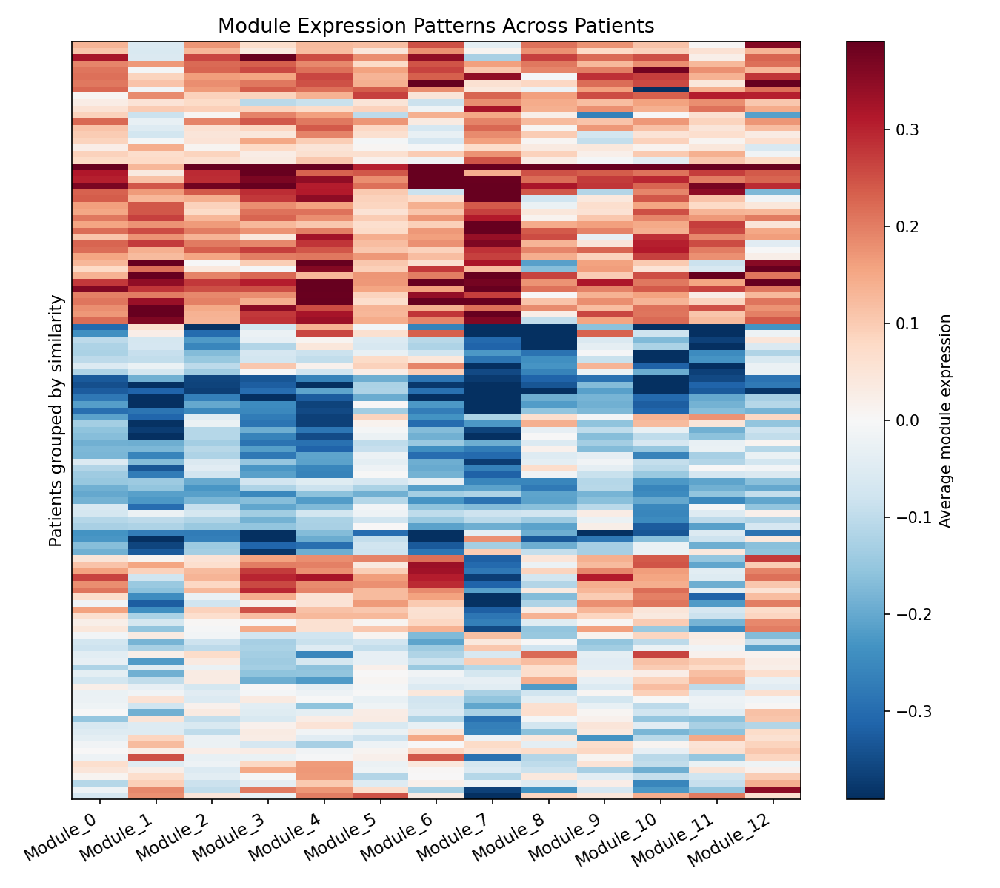
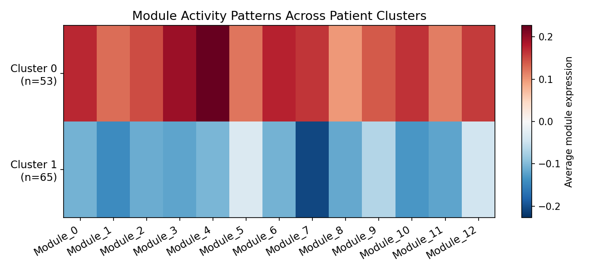

# 🧬 Proteomics PPI Network Construction, Clustering, & Functional Annotation Pipeline

An end-to-end bioinformatics pipeline that processes high-throughput proteomics data, builds a Protein-Protein Interaction (PPI) network, benchmarks predictions against a gold-standard reference (CORUM), detects network communities (modules), and annotates them with functional enrichment analysis (g:Profiler).

---

## 📊 Pipeline Workflow

The pipeline consists of four sequential stages implemented in Jupyter notebooks, transforming raw protein expression data into functionally characterized biological network modules.



---

## 🛠️ Step-by-Step Pipeline Breakdown

### 🧪 [Notebook 1: Data Cleaning and Quality Control](./1_data_preprocessing_and_qc.ipynb)
Processes the raw high-throughput label-free proteomics matrix containing **12,241 proteins across 118 patients** to prepare a clean dataset for correlation modeling.
*   **Filtering**: Removes proteins with poor coverage, defined as being detected in fewer than 50% of the patient cohort. This QC step filtered out **2,077 sparse proteins**, leaving a high-confidence set of **10,164 proteins**.
*   **Imputation**: Addresses missing values resulting from mass spectrometry detection limits using **down-shifted normal imputation** (shifting the mean of detected values down by $1.8 \sigma$ with a shrunk standard deviation of $0.3 \sigma$), which preserves the statistical characteristics of the lower limit of detection.
*   **Gold Standard Extraction**: Formats mammalian protein complex data from `CORUM_data.txt` and exports a pickled set of true-positive interacting protein pairs (`outputs/gold_pairs.pkl`) mapped to our detected proteome.

---

### 📈 [Notebook 2: PPI Prediction & Benchmarking](./2_ppi_prediction_benchmarking.ipynb.ipynb)
Compares metrics and determines the optimal co-expression correlation model to reconstruct the PPI network.
*   **Correlation Profiling**: Calculates genome-wide pairwise Pearson ($r$) and Spearman rank ($\rho$) correlation matrices ($10,164 \times 10,164$).
*   **Benchmarking**: Evaluates co-expression models against the CORUM gold standard database. True positive complex pairs are benchmarked against **500,000 randomly sampled negative protein pairs** to compute AUROC, AUPRC, and enrichment lift.
*   **Model Selection**: Spearman rank correlation outperformed Pearson correlation across all metrics, showing robust resistance to outliers:
    *   **Spearman Rank ($\rho$)**: **AUROC = 0.848**, **AUPRC = 0.567**, **Enrichment Lift = 7.8x**
    *   **Pearson ($r$)**: **AUROC = 0.846**, **AUPRC = 0.559**, **Enrichment Lift = 7.6x**
*   **Thresholding**: Top-ranked correlation pairs are extracted to create the predicted PPI network edge list (`outputs/network_edges.tsv`).

---

### 🕸️ [Notebook 3: Building Network and Detecting Modules](./3_network_construction_and_modules.ipynb)
Reconstructs the global physical interaction landscape and partitions it into biologically coherent modules.
*   **Graph Construction**: Constructs an undirected graph `G` containing **1,658 proteins (nodes)** and **8,987 interactions (edges)**.
*   **Topology Profiling**:
    *   **Network Density**: $0.0065$
    *   **Average Degree (Connectivity)**: $10.84$ connections per protein.
    *   **Giant Connected Component (GCC)**: Houses $449$ proteins ($27.1\%$ of the network), capturing the core physical cellular machinery.
*   **Hub Identification**: Identifies key central regulators by node degree, showing a scale-free network property. Key hub proteins include:
    *   `DDX17`: $96$ interactions (RNA helicase, transcription coactivator)
    *   `SF3B2`: $89$ interactions (Splicing factor subunit)
    *   `TOP2A`: $87$ interactions (DNA Topoisomerase II alpha)
    *   `KIF2C`: $85$ interactions (Kinesin family member)
*   **Community Detection**: Uses the Louvain and Leiden community detection algorithms to find functional protein modules, resulting in **14 distinct multi-protein clusters** (exported to `outputs/module_assignments.tsv`).

---

### 🧬 [Notebook 4: Functional Annotation](./4_functional_annotation.ipynb)
Links topological modules to patient phenotypes and biological pathways.
*   **Module Eigengenes**: Calculates module eigengenes (the first principal component/average expression profile of each module per patient) for the 13 modules containing $\ge 3$ proteins.
*   **Module Size Distribution**:
    *   `Module 0`: 116 proteins
    *   `Module 1`: 96 proteins
    *   `Module 2`: 95 proteins
    *   `Module 3`: 47 proteins
    *   `Module 4`: 24 proteins
    *   ... (and 8 smaller high-confidence clusters).
*   **Module Relationship Heatmaps**: Generates correlation heatmaps of module eigengenes to show higher-order coordinate pathways.
*   **Pathway Enrichment**: Conducts over-representation analysis (ORA) using **g:Profiler** across Gene Ontology (GO:BP, GO:MF, GO:CC) and pathway databases (KEGG, Reactome).

---

## 📁 Project Directory Structure

```directory
PROTEOMICS TASK/
│
├── 1_data_preprocessing_and_qc.ipynb         # QC, Filtering, and Imputation
├── 2_ppi_prediction_benchmarking.ipynb.ipynb  # ROC/PR Curves, CORUM Benchmarking
├── 3_network_construction_and_modules.ipynb  # Topology, Hubs, and Leiden Clustering
├── 4_functional_annotation.ipynb             # Eigengenes, Heatmaps, and g:Profiler
│
├── proteomics_data.txt                        # Input Proteomics Matrix (12,241 x 118)
├── CORUM_data.txt                             # Mammalian Protein Complexes Reference
├── requirements.txt                           # Python Environment Dependencies
├── Instructions.txt                           # Original Execution Guidelines
│
├── Presentation.pptx                          # Slide Deck summarizing Pipeline & Results
├── Report.pdf                                 # Comprehensive scientific project report
│
└── outputs/                                   # Output Deliverables
    ├── data_imputed.tsv                       # Preprocessed & Imputed Protein Matrix
    ├── gold_pairs.pkl                         # Pickled benchmark reference pairs
    ├── network_edges.tsv                      # Correlation-ranked high-confidence PPI edges
    ├── network_nodes.tsv                      # Network node degree list
    ├── module_assignments.tsv                 # Leiden module cluster mappings
    ├── patient_clusters.tsv                   # Patient subgroups based on module eigengenes
    │
    └── figures/                               # Visualizations & Plots
        ├── nb1v2_value_distribution.png       #QC Imputation distribution shifts
        ├── nb2v2_eval_curves.png              # AUROC and AUPRC curves vs CORUM
        ├── nb2v2_score_separation.png         # Distribution of positive vs negative scores
        ├── eigengene_heatmap.png              # Module correlation landscape
        ├── cluster_module_heatmap.png         # Patient clustering based on modules
        └── silhouette_scores.png              # Silhouette evaluation for patient groups
```

---

## 📊 Key Results Visualizations

Below are the key analytical plots generated during the pipeline run (located in `outputs/figures/`):

### 1. PPI Prediction Evaluation (AUROC & AUPRC)
Spearman rank correlation demonstrates excellent signal separation vs CORUM gold standard pairs.


### 2. Module Eigengene Correlation Heatmap
Provides a systems-level view of module co-regulation and functional integration.


### 3. Patient Cluster-Module Heatmap
Clustered module eigengenes segmenting the 118 patients into distinct clinical-molecular subgroups based on their pathway activation profiles.


---

## 🚀 Installation & Setup

Follow these steps to reproduce the network analysis pipeline locally.

### Prerequisites
*   Python 3.9+
*   Jupyter Notebook / JupyterLab

### 1. Clone & Navigate to Root Directory
Ensure you are in the project root directory containing the requirements and notebook files:
```bash
git clone <your-repository-url>
cd "PROTEOMICS TASK"
```

### 2. Set Up a Virtual Environment
Create and activate an isolated Python virtual environment to avoid version conflicts:
```bash
# Create the virtual environment
python -m venv venv

# Activate the virtual environment
# On Windows (Command Prompt)
venv\Scripts\activate.bat

# On Windows (PowerShell)
.\venv\Scripts\Activate.ps1

# On Linux/macOS
source venv/bin/activate
```

### 3. Install Dependencies
Install all package requirements listed in `requirements.txt`:
```bash
pip install --upgrade pip
pip install -r requirements.txt
```

### 4. Run the Jupyter Notebooks
Launch Jupyter to run the notebooks in sequential order (`1` to `4`):
```bash
jupyter notebook
```

> [!NOTE]
> Ensure the notebooks are executed in sequence as each step exports critical files to the `outputs/` directory needed for subsequent steps.

---

## 🏆 Deliverables & Reports
*   **Detailed Project Report**: See [Report.pdf](./Report.pdf) for complete scientific interpretations, biological pathway highlights, and clinical implications.
*   **Slide Presentation**: See [Presentation.pptx](./Presentation.pptx) for a high-level summary of the methods, benchmarks, and pathway clusters suitable for a presentation.
*   **Module Mappings**: See [module_assignments.tsv](./outputs/module_assignments.tsv) for the mapping of the 449 network proteins to their detected Louvain/Leiden modules.
